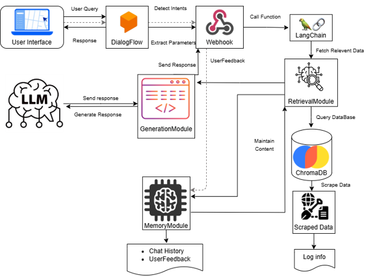
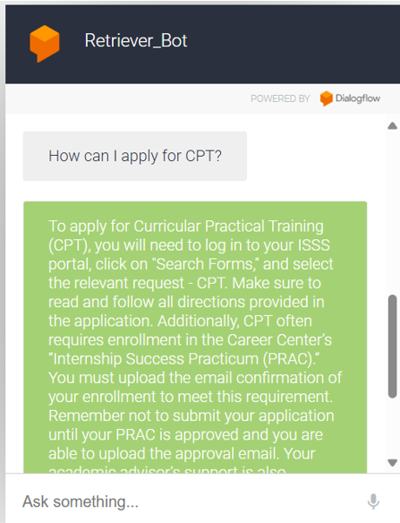
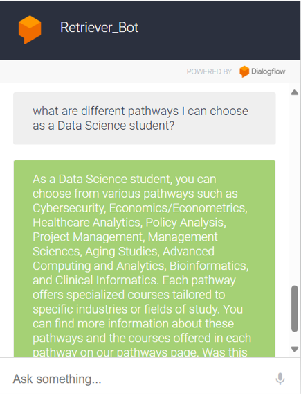
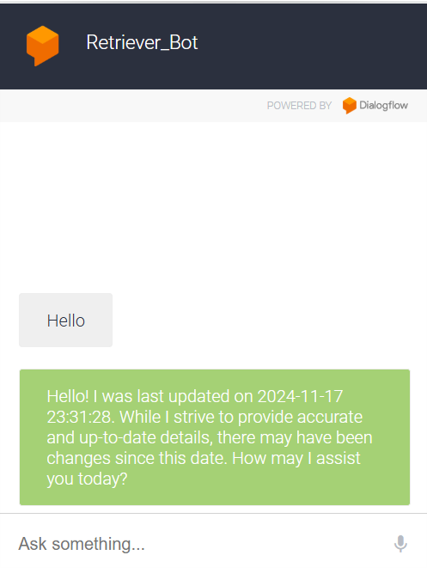

# Retriever Bot

## Table of Contents
1. [Overview](#overview)
2. [Research Questions](#research-questions)
3. [Features](#features)
4. [Architecture](#architecture)
5. [Implementation Details](#implementation-details)
6. [Repository Structure](#repository-structure)
7. [Prerequisites](#prerequisites)
8. [How to Get Started](#how-to-get-started)
   - [Quick Start Guide](#quick-start-guide)
   - [Colab Notebooks](#colab-notebooks)
   - [Advanced Setup](#advanced-setup)
9. [Workflow Steps](#workflow-steps)
10. [Logging](#logging)
11. [Future Enhancements](#future-enhancements)
12. [Results](#results)


---

## Overview

Retriever Bot is a cutting-edge conversational AI chatbot specifically designed for UMBC Data Science students to assist with a variety of information needs, including:

- 📘 **Course-related queries**
- 🧑‍🔬 **Faculty research details**
- 💬 **General program inquiries**

The chatbot integrates Dialogflow for intent recognition and utilizes OpenAI's GPT-3.5-turbo model for generating dynamic, context-aware responses. To enhance conversational retrieval capabilities, the application leverages LangChain and uses Chroma for efficient vector storage of embeddings.

## Research Questions

The following research questions guide the development and evaluation of Retriever Bot:

1. 🎯 **Effectiveness**: How effective is the Retriever Bot in improving access to specific information about coursework, faculty, and other program details, as measured by user satisfaction and reduced information search time?
2. 🌎 **CPT/OPT Guidance**: How can conversational AI enhance CPT and OPT registration guidance for international students, and how helpful will it be in improving user satisfaction?
3. ✅ **Accuracy**: How accurately can the chatbot respond to diverse student inquiries using up-to-date data from the UMBC Data Science website, and how well does this meet students' needs?

## Features

### Core Functionalities

- 🤖 **Intent Handling**: Custom intent mapping and management using Dialogflow for precise query understanding.
- 🔍 **Conversational Retrieval**: Utilizes LangChain and memory unit for retrieving relevant and contextually accurate information.
- 🗣️ **Feedback Mechanism**: Gathers user feedback to iteratively improve the bot’s responses.
- 🛠️ **Meta Data Filtering and Contextual Understanding**: Leverages memory for enhanced contextual responses and metadata filtering.
- 🔄 **Automated Data Scraping**: Periodic scraping and updating of embeddings ensure the chatbot stays current with the latest information.

### Deployment and Scalability

- 🐳 **Dockerized Deployment**: Ensures consistent and scalable deployment across environments.
- 🚀 **Continuous Integration and Deployment (CI/CD)**: Automated builds and deployments using GitHub Actions streamline updates.

## Architecture
The following diagram illustrates the architecture of the Retriever Bot system:


### Architecture Overview

- 🤖 **Dialogflow**: Handles intent recognition and context management categorizing user queries into predefined intents for routing to the appropriate response pipeline.
- 🧠 **LangChain**: Manages conversational retrieval workflows, maintaining context across interactions.
- 💡 **OpenAI GPT-3.5-turbo**: Generates coherent, context-aware responses tailored to user inputs.
- 📂 **Chroma**: Stores and manages embeddings for efficient retrieval of relevant data.
- 🔄 **Automated Data Scraping Pipelines**: Periodically updates the knowledge base by scraping the UMBC Data Science website.
- 🚀 **CI/CD Pipelines with GitHub Actions**: Automates the building, and deployment of the application.

## Implementation Details

- 🤖 **Dialogflow**: Includes custom intents for academic queries, administrative tasks (e.g., CPT/OPT guidance), and fallback intents for ambiguous queries.
- 🧠 **LangChain with memory**: Facilitates conversational retrieval, ensuring relevant embeddings are fetched based on query similarity.
- 📂 **Chroma**: Utilizes OpenAI's Ada 002 text embedding model for high-quality vector representations and efficient retrieval.
- 🌐 **Selenium**: Used for automated scraping of the UMBC Data Science website(dil.umbc.edu).

## 📁 Repository Structure

```plaintext
RetrieverBot/
├── .github/
│   └── workflows/
│       ├── docker-build.yml
├── assets/
│   └── images
├── data/
│   └── ...  # Data files used by the application
├── embeddings.py
├── feedback.py
├── intent_handler.py
├── main.py
├── prompts.py
├── query_handler.py
├── scraping.py
├── Dockerfile
├── requirements.txt
├── README.md
├── .dockerignore
├── .gitignore
├── .env.example
```

### Key Components

- **`.github/workflows/`**: Contains GitHub Actions workflows for CI/CD automation.
- **`assets/`**: Stores images and assets for documentation purposes.
- **`data/`**: Directory for data files and embeddings used by the bot.
- **`embeddings.py`**: Manages embedding models and vector store interactions.
- **`feedback.py`**: Implements user feedback mechanisms for iterative improvement.
- **`intent_handler.py`**: Handles custom intent mapping and management.
- **`main.py`**: The main application file for running the chatbot.
- **`prompts.py`**: Stores reusable prompt templates for different intents.
- **`query_handler.py`**: Processes user queries and handles retrieval operations.
- **`scraping.py`**: Automates data scraping and preprocessing.
- **`Dockerfile`**: Configures Docker for containerized deployment.
- **`requirements.txt`**: Lists Python dependencies for the project.
- **`.env.example`**: Provides a template for environment variables configuration.

## Prerequisites

To run this project, ensure you have the following:

- 🐍 Python 3.13
- 🐳 Docker
- 🌲 Git
- 🔑 An OpenAI API Key
- 🤖 A Dialogflow Agent

## How to Get Started

### 🌐 Colab Notebooks
To make the project more accessible, we provide Jupyter Notebook files that can be run directly on Google Colab. These notebooks include step-by-step examples and allow users to test and interact with various components of the Retriever Bot, including scraping, embedding generation, and chatbot interactions.

- [Data Scraping](https://drive.google.com/file/d/1i1SXSxEjtGyuHH3garqGlijxhPrOZkU_/view?usp=sharing)
- [Chatbot Interaction Notebook](https://colab.research.google.com/drive/1IgwI92aAHWaNaYtQUwxhrqZUbuWscBHB?usp=sharing)

### Quick Start Guide

1. 🌀 Clone the repository:

   ```bash
   git clone https://github.com/yourusername/retriever-bot.git
   ```

2. 📂 Navigate to the project directory:

   ```bash
   cd retriever-bot
   ```

3. 🛠️ Create a Virtual Environment (Recommended):

   ```bash
   python -m venv venv
   source venv/bin/activate  # On Windows: venv\Scripts\activate
   ```
4. 📦 Install dependencies:

   ```bash
   pip install -r requirements.txt
   ```

5. 🔗 **Set Up Ngrok**:
   - Download and install [Ngrok](https://ngrok.com/).
   - Start Ngrok to expose your local application to the web:

     ```bash
     ngrok http 5000
     ```
    **Create a Dialogflow Agent**:
   - Set up a Dialogflow agent in your Google Cloud project.
   - Define intents (Get_Course_info,Get_CPT_OPT_info,Get_General_info, Get_Research_info ) and ensure they are trained with some initial phrases.
   - Set the webhook URL in the Dialogflow console to your Ngrok public URL.
   
6. 🤖 Run the Bot:
   ```bash
   python main.py
   ```
   
7. 🌐 Access the chatbot in Dialogflow Integration Tab.

#### Usage Examples
Here are some example questions that UMBC Data Science students can ask the Retriever Bot:

- "How can I apply for CPT?"
- "What are the different pathways I can choose as a Data Science student?"
- "What are the course outcomes of DATA 604"
- "Are there any research opportunities in the filed of Natural Language Processing?"

### Advanced Setup 
#### 🐳 Dockerized Deployment - For a consistent and scalable deployment
To use the Dockerized Retriever Bot, ensure you have a [Docker Hub](https://hub.docker.com/) account. If you want to reproduce this project or modify it, you need to:

- **Create a Docker Hub Account**: Sign up at [Docker Hub](https://hub.docker.com/).
- **Specify Docker Hub Details in GitHub Secrets**: Add your Docker Hub username, repository, and access token to GitHub Secrets for CI/CD integration.
  - `DOCKER_USERNAME`: Your Docker Hub username.
  - `DOCKER_REPO`: Your repository name (e.g., `retriever-bot`).
  - `DOCKER_ACCESS_TOKEN`: Your Docker Hub access token.

- ** 🔄 Build and Push the Docker Image**: The GitHub Actions workflow (`docker-build.yml`) automates building and pushing images to Docker Hub.

- ** 🛠️ Pull and Run the Docker Image**: Once updated, use the following commands to pull and run the image:
  ```bash
  docker pull your-dockerhub-username/retriever-bot:latest
  docker run -e OPENAI_API_KEY='<your_openai_api_key>' -p 8080:5000 retriever-bot
  ```
Ensure to update the webhook URL whenever modifications are made and access the chatbot in dialogflow Integration.

#### 🚀 Docker Build and Push Workflow

- **Workflow File**: Located at `.github/workflows/docker-build.yml`.
- **Trigger**: Runs on every push to the `main` branch.
- **Steps**:
  - Checks out the repository.
  - Sets up Python.
  - Installs dependencies.
  - Runs `scraping.py` which is scheduled monthly.
  - Commits and pushes any changes.
  - Triggers the Docker build and push the new image into docker hub if data has changed.

## Logging

We are maintaining logs in the `scrape_log.log` file to track scraping activities and errors.

## 🔮 Future Enhancements

### Cloud Hosting for Webhook Stability
- Deploy the Dockerized backend on a cloud service like Google Cloud Run, AWS Fargate, or Heroku.
- Obtain a stable public HTTPS endpoint to replace the temporary Ngrok URLs.
- Automate updates to Dialogflow webhook configurations with CI/CD pipelines.

### Continuous Deployment Enhancements
- Extend CI/CD workflows to:
  - Build and push Docker images directly to the cloud hosting platform.
  - Ensure all updates are deployed without manual intervention.

### Multi-User Session Management
- Introduce session handling to allow multiple users to interact simultaneously without losing context.

### Feedback Integration and Auto-Training
- Enhance chatbot performance by integrating user feedback into automatic training pipelines.
- Continuously improve response accuracy and relevance.

### Backend Database Integration
- Implement a database for efficient data persistence and management.
- Use cases include storing user preferences, conversation history, and feedback.
- Enable detailed analytics and reporting for chatbot interactions.

### Caching for Performance Optimization
- Implement caching mechanisms (e.g., Redis) for frequently asked questions and repetitive queries.
- Reduce response time and improve user experience.

## Results

Below are some examples of interactions with the Retriever Bot:

- **CPT Query:**

  

- **Pathways Information:**

  

- **Welcome Message:**

  


We welcome contributions to enhance the functionality of Retriever Bot. Feel free to submit issues or pull requests to make this project even better!

